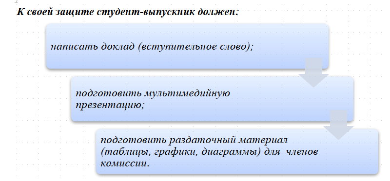
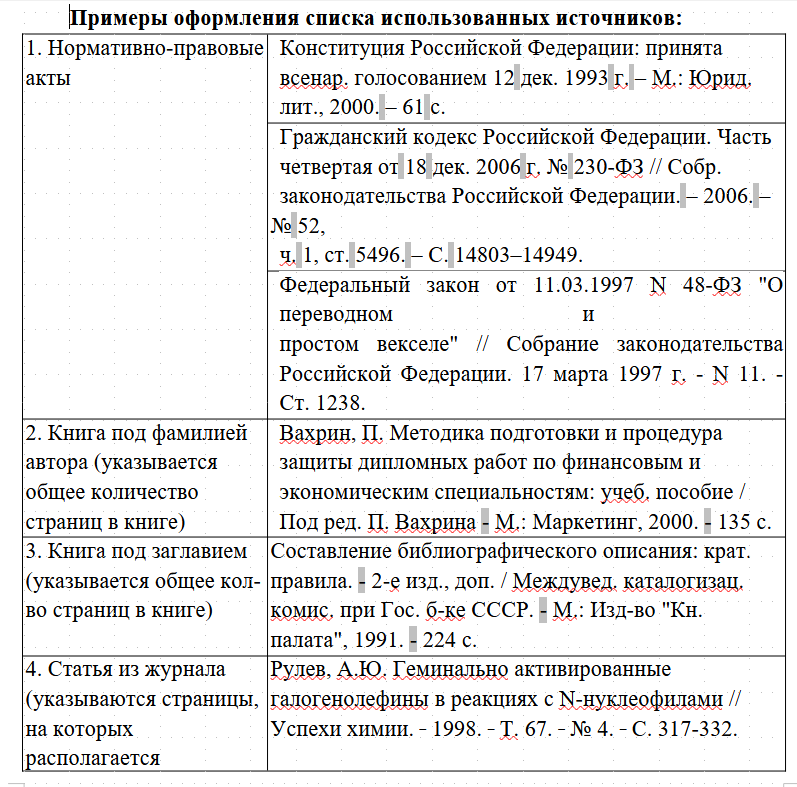
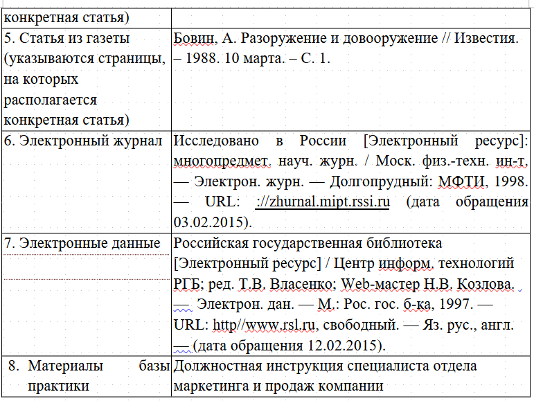
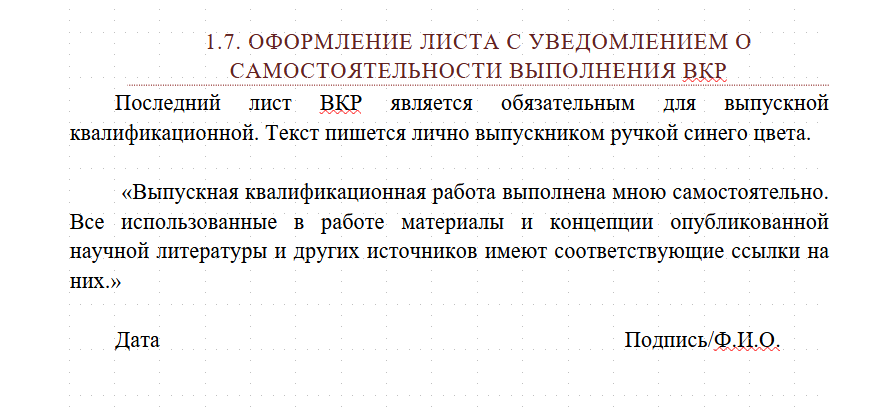

= План ВКР
Timofey Chuchkanov <ttchuchkanov@yandex.ru>
:toc-title: Содержание
:icons: font
:toc:

== Структура работы
TIP: Объем ВКР не менее 40--50 страниц.

TIP: Время доклада 10--15 минут.

Обоснование актуальности работы должно быть кратким и не замниать более 1/3 части введения.

Актуальность исследования –- это обоснование проблемы исследования с точки зрения её социальной и научной значимости 
в настоящее время.

Далее формулируется цель исследования.  Указываются конкретные задачи (3-5 задач), которые предстоит решать в соответствии с данной целью.
Обязательными элементами введения является формулировка объекта и предмета исследования. 
Объект исследования - это процесс или явление, порождающее проблемную ситуацию и избранные для изучения.

Предмет - это то, что находится в границах объекта. Соотношение объекта и предмета - как общее и частное. В объекте выделяется та его часть, которая служит предметом исследования. Предмет исследования должен совпадать с темой выпускной квалификационной работы.

* Титульный лист
* Задание (в объем работы не входит)
* Содержание
* Введение
* Основная часть
** Теоритическая часть
** Практическая часть
** Аналитическая часть
** Охрана труда, техника безопасности
* Заключение
* Список сокращений
* Библиографический список
* Приложения

=== Объем
Введение:: Не более 3 страниц.
1 часть:: 2--3 подраздела, объем 10--12 страниц.
2 часть:: Объем 25--30 страниц, около 50--60% всей работы.
3 часть:: Объем 10--15 страниц.
Заключение:: 3--4 страницы
Библиографический список:: Не менее 20--30 наименований.
Приложения:: Не входят в объем ВКР.

=== Оформление
* 1,5 интервала, Times New Roman 14
* Полужирный шрифт не применяется
* Выравнивание по ширине
* Абзацный отступ -- 15 мм
* Поля
** Левое -- 30 мм
** Правое -- 10 мм
** Верхнее и нижнее -- 20 мм

[TIP]
====
Библиографический список включает источники (в том числе электронные) и литературу, использованные студентом в ходе подготовки и написания работы и содержит не менее 20-30 наименований. Список использованных источников должен содержать библиографическое описание законодательных и нормативно-методических материалов, научных и учебных периодических изданий, использованных при написании работы.
====

TIP: На титульном листе и в содержании страницы _не_ нумеруются. Остальные листы пронумерованы.

Нумерация страниц посередине верхнего поля 12 шрифтом.

Наименования структурных элементов (ВВЕДЕНИЕ, РАЗДЕЛ/ГЛАВА. НАЗВАНИЕ) в середине строки прописными буквами. Каждый структурный элемент с нового листа. Но подразделы начинаются на той же странице, что закончился предыдщуий подраздел.

Заголовки подразделов с абзацного отступа с прописной буквы. Без точки в конце.

Расстояние между заголовком и текстов одна строка.

При перечислениях ставится дефис.

....
- первый элемент;
- второй элемент.

1) ...
2) ...

а) ...
б) ...
в)
  1) ...
....

Математические симфолы нельзя писать без цифр -- только словами.

Изображения подписываются как Рисунок <номер> -- Описание. Снизу по центру

Таблицы подписываются сверху, Таблица <номер> -- Описание.

При переносе части таблицы на другую страницу слово «Таблица», ее номер и наименование указывают один раз слева над первой частью таблицы, а над другими частями также слева пишут слова «Продолжение таблицы» и указывают номер таблицы.

Ссылки на использованные источники следует указывать порядковым номером библиографического описания источника в списке использованных источников. Порядковый номер ссылки заключают в квадратные скобки (например: [9]). Если ссылку приводят на конкретный фрагмент текста документа, тогда указывают порядковый номер и страницы, на которых помещен объект ссылки. Сведения разделяют запятой 
(например: [9, с. 123]).

Цитаты должны заключаться в кавычки со ссылкой на источник.

Цифровой материал, который заимствуется из неопубликованных источников (материалы организаций), должен использоваться со ссылкой на источник (например, расчеты произведены по данным формы № 2 за 2014 г.).
При необходимости дополнительного пояснения в тексте его допускается оформлять в виде сноски. Знак сноски ставят непосредственно после того слова, числа, символа, предложения, к которому дается пояснение. Знак сноски выполняют надстрочно арабскими цифрами со скобкой. Допускается вместо цифр выполнять сноски звездочками "*". Применять более трех звездочек на странице не допускается.

Список использованных источников следует составлять в следующем порядке:
	1. Нормативно-правовые акты: (нижеперечисленные документы располагаются в порядке субординации, а внутри каждого из разделов – в очередности от последнего года принятия к предыдущим)
	- Международно-правовые акты;
	- Конституция РФ, уставы субъектов РФ;
- Декларации, Федеративный Договор;
- Федеральные конституционные законы, Кодексы, Федеральные законы;
- Акты Президента РФ;
- Ежегодные послания Президента РФ Федеральному Собранию РФ;
- Акты палат Федерального Собрания РФ;
- Акты Правительства РФ;
- Акты федеральных органов исполнительной власти РФ;
- Законы и иные нормативно-правовые акты субъектов РФ;
- Акты Конституционного Суда РФ, Верховного Суда РФ, Высшего Арбитражного Суда РФ и других судов;
- Акты представительных и исполнительных органов государственной власти субъектов РФ;
- Уставы муниципальных образований;
- Акты выборных органов местного самоуправления и выборных должностных лиц местного самоуправления;
- Локальные акты.
2. Научная и учебная литература по теме: учебные пособия, монографии, статьи из сборников, статьи из журналов, авторефераты диссертаций (расположение источников - в порядке алфавита фамилий авторов).
3. Справочная литература (энциклопедии, словари, словари-справочники).
4. Иностранная литература. Описание дается на языке оригинала (расположение источников - в порядке алфавита).
5. Описание электронных ресурсов (расположение источников - в порядке алфавита).

[TIP]
====
1. Список источников составляют на отдельной странице (листе).
2. Заголовок пишут прописными буквами.
3. Каждая библиографическая запись в списке получает порядковый номер (арабская цифра с точкой) и начинается с абзацного отступа. Нумерация источников в списке сквозная.
====

== План работы
=== ГЛАВА 1. ОСНОВНЫЕ ПОНЯТИЯ, МЕТОДОЛОГИИ И ТЕХНОЛОГИИ
==== 1.1 Методология DevOps, и ее роль в современном мире
Раскрыть понятие DevOps, а также описать методологию DevOps.
Провести анализ, почему она набирает все бо&#x301;льшую популярность, и на решение каких проблем нацелена.
Тут можно будет вставить всякие красивые шаблонные картинки из нета, описать саму суть этих непрерывных процессов, и что в плане технологий используются штуки вроде CI/CD.

Здесь, скорее всего, стоит поискать какие-то исследования, и сослаться на них.
Как минимум статистическую инфу точно, для подтверждения своей аргументации.

==== 1.2 Контейнеризация и виртуализация. Сферы применения и основные технологии
Пройтись по понятиям контейнеризации и виртуализации, описать, в чем их различия, и базовые принципы работы. Почему и те и те попуплярны, и для каких задач в основном применяются.
Привести примеры гипервизоров (KVM, Xen, ESXi, Hyper-V) с раскрытием понятия "`гипервизор`",
привести примеры "`рантаймов`" контейнеров (containerd, CRI-O, LXC) и технологий на их базе 
(Docker, Podman).

Поискать какую-то статистическую инфу по росту востребованности контейнеризованных технологий, 
и скорости развития этих технологий. Как они в каких-то областях вытеснили обычную 
виртуализацию, и почему это хорошо.

NOTE: Для контейнеризации это может быть, например, девконтейнеры, временные среды сборки ПО, среды для работы конечного программного продукта, лямбда-функции у облачных провейдеров, и так далее.

==== 1.3 Автоматизация управления конфигурацией. Понятие инфраструктуры как кода
Раскрыть понятие IaC. Рассказать про платформы автоматизации управления конфигурацией (Ansible, Chef, Puppet) и связать это все с IaC. Почему в соверемнном мире сложно обойтись без подобных инструментов. Рассказать про Terraform и Pulumi.

=== ГЛАВА 2. МОДЕРНИЗАЦИЯ ИНФРАСТРУКТУРЫ КОМПАНИИ ЗАО "`ЭВАЛАР`". СОЗДАНИЕ КУЛЬТУРЫ DEVOPS
==== 2.1 Анализ имеющейся инфраструктуры и подхода к работе. Выделение проблем
Здесь рассказать про то что на текущий момент компания находится только на начальных этапах развития культуры DevOps. Рассказать про стенды разработчиков, и каким образом они развертываются.
На чем развернута рабочая нагрузка. Какие проблемы все это создает. 

==== 2.2 Поиск способов решения выделенных проблем. Разработка плана модернизации
Какие рабочие моменты и как следует изменить, чтобы решить выделенные выше проблемы. Какие виды инструментов можно применять. 
Описать свой план модернизации, который включает в себя сначала перенос стендов разработки в разворачиваемую среду, про обкатку всего этого дела, и дальнейший перенос производственной среды туда же.
Перенос производственной среды будет осуществляться через какое-то время после защиты ВКР, так что это надо будет еще упомняуть в заключении в разделе дальнейшего развития проекта.

.Также тут надо будет сказать, зачем нам нужен Kubernetes. Это в себя будет включать:
****
* Портативность инфраструктуры -- все проекты можно будет переносить относительно легко на другую инфраструктуру или даже в облако, при необходимости;
* Откроет дополнительные возможности автоматизации;
* Позволит в случае непредвиденных проблем выполнять откат релизов к предыдущим версиям;
* Даст больше возможностей для масштабирования проектов по мере необходимости;
* Обеспечит бо&#x301;льшую устойчивость к проблемам рабочей нагрузки за счет самовосстановления.
****

==== 2.3 Начало реализации плана по модернизации инфраструктуры
Описать процессы реализации проекта -- развертывание кластера, перенос стендов разработки (пока перенесен полноценно только стенд одного из проектов).
Проектов десятки, так что это займет какое-то время, но в дальнейшем это окупится.

Рассказать про:
. Выбор проекта
. Проектирование кластера (включая схему)
. Развертывание кластера
. Портирование проекта
. Перенос стендов разработки
